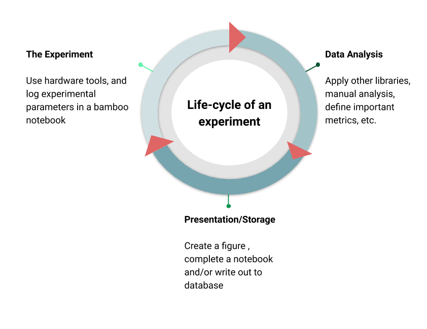

.. bamboo documentation master file, created by
   sphinx-quickstart on Fri Jul 24 19:08:25 2020.
   You can adapt this file completely to your liking, but it should at least
   contain the root `toctree` directive.

bamboo
==================================

Bamboo standardizes the organization, acquisition, storage, and
presentation of data generated in biophysical research.
It is meant to sandwich a data analysis pipeline,
logging and storing experimental metadata as well as results of data analysis.
The philosophy of the library is to streamline file naming, logging, and
storage/retrieval so focus can be given to more important things.

Framework
---------

The Experiment
--------------
Lab notebook for logging protocols, experimental parameters, etc.
Design a template that aggregates image data, figures, plots, experimental
parameters, etc.

Data Analysis
-------------
This is the part where bamboo takes the backseat. Use whatever image analysis
or raw data analysis techniques you need to, organize everything in an excel
sheet or csv and move on to the next stage: presentation/storage.

Presentaton/Storage
-------------------
This is the terminal end of a project or iteration. Use built-in figure
templates and matplotlib wrappers to create publication-quality plots or output
the raw data to a database. Importantly, the 'database' may not be an RDBMS
or the-like. Bamboo wraps the rclone program to sync data, pdfs, etc. to a
cloud storage provider such as Box or Google Drive, if desired.

Contents
--------

.. toctree::
   :maxdepth: 1

   install
   project
   notebook
   modules
   format_ax
   canvas
